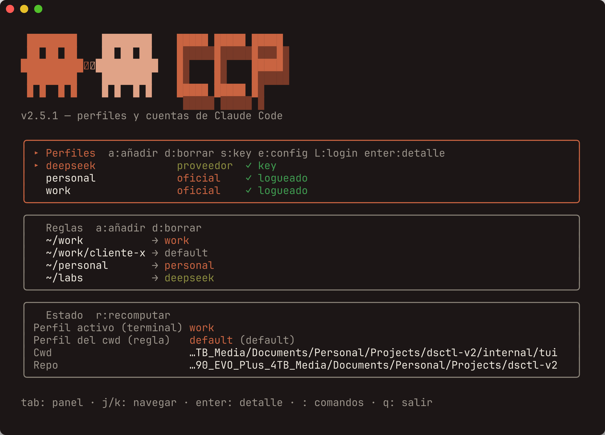
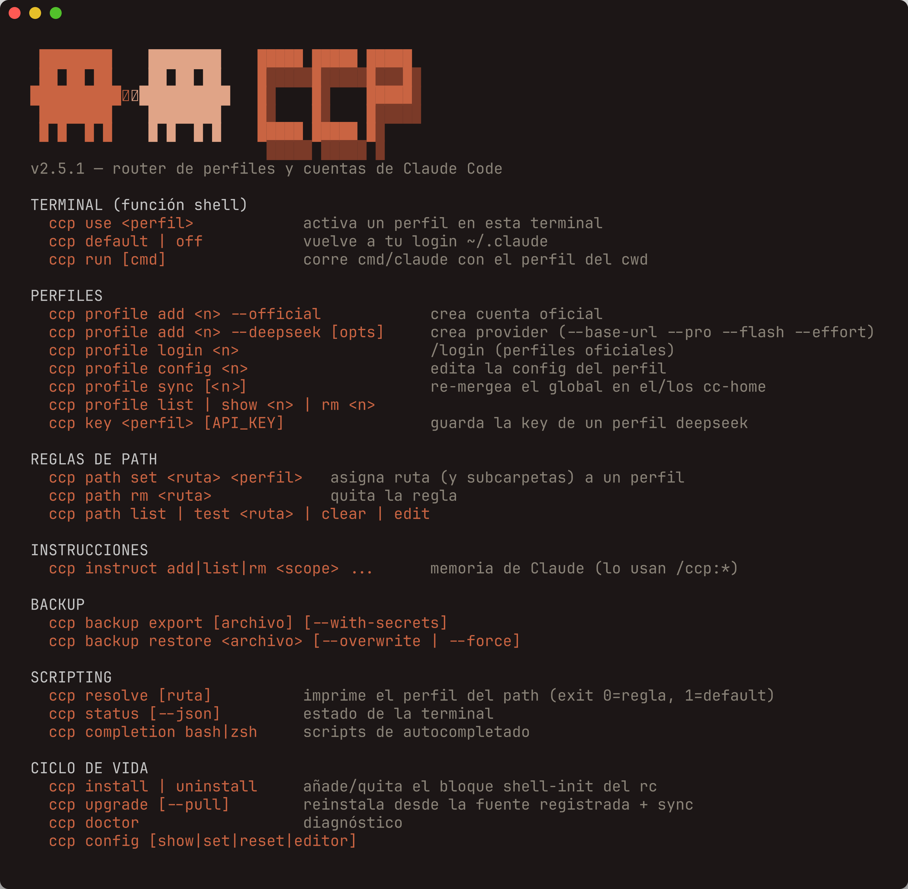

<div align="center">

# ccp

**Perfiles para Claude Code.**

[English](README.md) · **Español**

**Una cuenta de Claude Code distinta en cada carpeta.**
En tu repo de trabajo, tu cuenta de empresa; en tu proyecto personal, la tuya; en tus experimentos, DeepSeek.
El cambio ocurre solo, con hacer `cd`.




</div>

---

## Qué es

`ccp` enruta Claude Code a un **perfil** por terminal y por carpeta — nunca global. Un perfil es una de tres cosas:

- una **cuenta oficial** de Anthropic (su propio `CLAUDE_CONFIG_DIR` aislado),
- un **proveedor** compatible tipo DeepSeek (su `ANTHROPIC_BASE_URL` + API key), o
- el reservado **`default`**: tu login normal de `~/.claude`.

Así: repo A → cuenta *work*, repo B → cuenta *personal*, repo C → *deepseek*. Sin tocar nada a mano.

## El modelo mental (30 segundos)

1. Un **perfil** es una identidad (oficial, proveedor, o `default`).
2. Una **regla** dice "esta carpeta (y sus subcarpetas) usa tal perfil".
3. Gana la regla **más específica**. Sin regla → tu login normal.

```text
~/work          → perfil "work"      (cuenta empresa)
~/work/cliente  → perfil "default"   (carve-out: tu login normal)
~/personal      → perfil "personal"  (cuenta personal)
~/labs          → perfil "deepseek"
~               → default
```

Cuando entras a una carpeta, `ccp` aplica el perfil correcto en esa terminal mediante un hook. Luego corres `claude` normal.

## La interfaz

Corre `ccp` sin argumentos (con TTY) y obtienes el **dashboard interactivo** de la foto de arriba: tres paneles (Perfiles · Reglas · Estado) con navegación por teclado, indicadores de salud (`✓` login / key), y una barra de comandos `:` con **autocompletado** (Tab). Cada acción tiene su comando CLI equivalente.

¿Sin TTY o prefieres la terminal? Todo está en el CLI, con la misma paleta:

<div align="center">

</div>

---

## Antes de empezar

- macOS o Linux con **bash** o **zsh**.
- **Claude Code** instalado (que `claude --version` funcione).
- **git**.

## Instalación

Una sola vez:

```bash
./install.sh          # 1. binario (descarga el release prebuilt y verifica sha256)
ccp install           # 2. función de shell + hook automático
source ~/.zshrc       # 3. recarga TU shell (o ~/.bashrc)
ccp doctor            # 4. confirma que quedó bien
```

Si el paso 1 te avisa que `~/.local/bin` no está en tu PATH, añádelo a tu rc:

```bash
export PATH="$HOME/.local/bin:$PATH"
```

## Actualizar

`install.sh` registra de qué repo instalaste, así que actualizar es un comando:

```bash
ccp upgrade            # re-instala + re-sincroniza perfiles (profile sync)
ccp upgrade --pull     # hace 'git pull' antes de re-instalar
ccp upgrade --no-sync  # solo el binario, sin tocar perfiles
```

Si vienes de la versión Bash (`dsctl`) o de un `ccp` viejo, la **migración es automática y perezosa**: la primera vez que corras cualquier comando que toque la config, convierte tu estado a `ccp.yaml` (schema v2), respaldando antes en `~/.config/ccp/.backup-pre-go-<fecha>`.

---

## Uso

### Caso 1 — Tu cuenta de trabajo en tu carpeta de trabajo

```bash
ccp profile add work --official    # 1. crea el perfil oficial
ccp profile login work             # 2. una vez: dentro, /login y /quit
ccp path set ~/work work           # 3. asigna la carpeta
cd ~/work && claude                # 4. arranca con tu cuenta de trabajo
```

### Caso 2 — Añadir tu cuenta personal

Igual que el caso 1, con otro nombre y otra carpeta:

```bash
ccp profile add personal --official
ccp profile login personal
ccp path set ~/personal personal
```

### Caso 3 — Una carpeta con DeepSeek

```bash
ccp profile add deepseek --deepseek   # perfil de proveedor
ccp key deepseek                      # guarda la API key (te la pide oculta)
ccp path set ~/labs deepseek
cd ~/labs && claude
```

### Caso 4 — Sacar una subcarpeta de su regla (carve-out)

Tu `~/work` usa la cuenta de trabajo, pero hay un cliente puntual donde quieres tu login normal:

```bash
ccp path set ~/work/cliente-x default
```

`~/work` sigue en "work", pero `~/work/cliente-x` usa tu login normal. La subcarpeta más específica siempre manda.

### Caso 5 — Cambiar a mano en una terminal

```bash
ccp use personal      # activa un perfil aquí
ccp default           # vuelve a tu login normal
ccp run claude        # corre Claude una vez con el perfil del cwd, sin fijarlo
```

### Caso 6 — Ver qué está pasando

```bash
ccp status            # perfil activo + perfil del cwd
ccp path list         # tus reglas de carpeta
ccp profile list      # tus perfiles
ccp doctor            # logins, keys, función de shell
```

---

## Backup y restore

Llévate todo a otra máquina, o respáldalo antes de un cambio grande:

```bash
ccp backup export ~/ccp-backup.tar.gz                 # ccp.yaml + overlays
ccp backup export ~/ccp-backup.tar.gz --with-secrets  # + api_key + logins (chmod 600)
ccp backup restore ~/ccp-backup.tar.gz                # no pisa; fusiona reglas
ccp backup restore ~/ccp-backup.tar.gz --overwrite    # reemplaza perfiles del backup
ccp backup restore ~/ccp-backup.tar.gz --force        # borra todo y restaura limpio
```

Antes de restaurar, `ccp` guarda un snapshot automático en `~/.config/ccp/.backup-pre-restore-<fecha>`.

## Config por perfil

Cada perfil tiene su propia config de Claude, aplicada como **capa baseline** cuando está activo:

```bash
ccp profile config <perfil>                 # menú: instrucciones / settings / ambos
ccp profile config <perfil> instructions    # abre overlay/CLAUDE.md
ccp profile config <perfil> settings         # abre overlay/settings.overlay.json
ccp profile sync [<perfil>]                  # re-mergea cambios del global ~/.claude
ccp config editor "code -w"                  # editor a usar (fallback: $EDITOR)
```

- **Instrucciones**: `cc-home/CLAUDE.md` hace `@import` del global `~/.claude/CLAUDE.md` y luego de tu overlay.
- **Settings**: `cc-home/settings.json` = global ⊕ overlay (deep-merge puro en Go).
- **Prioridad real**: es una baseline — la config del repo (`.claude/settings.json`) gana en conflicto.
- `default` no tiene overlay: `ccp profile config default` abre tu `~/.claude` global directo.

## Comandos `/ccp:` — recordar y explorar artefactos

`ccp` incluye cinco comandos de Claude Code para persistir instrucciones, agents, hooks y MCP servers directo desde la conversación, sin editar archivos a mano:

| Comando | Qué hace |
|---|---|
| `/ccp:remember-global <texto>` | Persiste al `~/.claude` global (todos los perfiles) |
| `/ccp:remember-profile <texto>` | Persiste al overlay del perfil activo |
| `/ccp:remember-project <texto>` | Persiste al `.claude/` del repo git actual (versionado) |
| `/ccp:recall [scope]` | Lista lo que ccp gestiona (`global` · `profile` · `project`) |
| `/ccp:forget [scope]` | Borra por índice (lista y confirma antes) |

Se instalan con `install.sh` en `~/.claude/commands/ccp/` y quedan disponibles en todos los perfiles. La superficie CLI equivalente es `ccp instruct <add\|list\|rm\|dest\|record>`.

---

## Idioma

`ccp` habla inglés por defecto y también español. Elige el que prefieras; la elección se persiste en `ccp.yaml`.

```bash
ccp lang              # muestra el idioma actual + de dónde sale (env/config/default)
ccp lang en           # cambia a inglés y lo persiste en ccp.yaml
ccp lang es           # cambia a español y lo persiste en ccp.yaml
```

- `CCP_LANG=en|es` — override por entorno; tiene prioridad sobre la config. El valor por defecto es inglés.
- En el dashboard interactivo (TUI), pulsa **`L`** para cambiar el idioma en vivo (se persiste). Ojo: en el TUI, **iniciar sesión** (login) está en la **`l`** minúscula, y **`L`** (mayúscula) cambia el idioma.

---

## Configurar a mano (`ccp.yaml`)

Todo vive en `~/.config/ccp/ccp.yaml` (o `$CCP_HOME/ccp.yaml`). Puedes tocarlo con comandos o a mano:

```yaml
version: 2
defaults:                  # plantilla para perfiles deepseek NUEVOS
  base_url: https://api.deepseek.com/anthropic
  model_pro: deepseek-chat
  model_flash: deepseek-chat
  effort: high
  editor: nano
profiles:
  work:                    # oficial: solo 'type'
    type: official
  deepseek:                # proveedor: los 4 campos, explícitos
    type: deepseek
    base_url: https://api.deepseek.com/anthropic
    model_pro: deepseek-chat
    model_flash: deepseek-chat
    effort: high
rules:                     # carpeta → perfil (ruta absoluta)
  - path: /Users/tu/work
    profile: work
  - path: /Users/tu/work/cliente-x
    profile: default       # carve-out
authored: []
```

- `default` es **implícito**: nunca lo pongas en `profiles`. Para una excepción, usa `profile: default` en una regla.
- La API key **no** va aquí: vive en `~/.config/ccp/profiles/<n>/api_key` (`chmod 600`). Edítala con `ccp key <n>`.
- `ccp` escribe atómico bajo un `flock`, conserva tus comentarios, y aborta si el `version` es mayor que el que conoce.

Con comandos: `ccp config show` · `ccp config set <clave> <valor>` · `ccp config reset`.

---

## Solución de problemas

| Síntoma | Arreglo |
|---|---|
| `ccp: command not found` | `~/.local/bin` no está en tu PATH (paso 2 de Instalación). |
| `ccp use …` no cambia nada | Falta la función de shell: `ccp install` y luego `source ~/.zshrc`. |
| Cambié de carpeta y el perfil no cambió | El hook recuerda la última carpeta; refresca con `cd .` |
| Al abrir Claude dice "Not logged in" | Ese perfil oficial no tiene sesión: `ccp profile login <n>`. |
| Ver el perfil de una carpeta sin entrar | `ccp resolve ~/ruta/que/sea` |

## Referencia rápida

| Quiero… | Comando |
|---|---|
| Crear cuenta oficial | `ccp profile add <n> --official` |
| Iniciar sesión en ella | `ccp profile login <n>` |
| Crear proveedor DeepSeek | `ccp profile add <n> --deepseek` |
| Guardar su API key | `ccp key <n>` |
| Asignar carpeta → perfil | `ccp path set <ruta> <perfil>` |
| Quitar una regla | `ccp path rm <ruta>` |
| Ver reglas / perfiles | `ccp path list` · `ccp profile list` |
| Cambiar a mano | `ccp use <n>` · `ccp default` |
| Estado / diagnóstico | `ccp status` · `ccp doctor` |
| Backup / restore | `ccp backup export\|restore` |
| Actualizar | `ccp upgrade` |
| Ayuda completa | `ccp help` |

> **Para scripting:** `ccp resolve [ruta]` imprime el perfil (exit `0` = no-default, `1` = default), y `ccp status --json` devuelve `active`, `profile`, `profile_type`, `cwd` y `repo`.

## Guía interactiva

¿Prefieres una guía visual paso a paso? Abre [`README.html`](README.html) en tu navegador — es una app de una sola página con playground de routing, tooltips y todos los casos:

```bash
open README.html        # macOS
xdg-open README.html    # Linux
```

## Desinstalar

```bash
ccp uninstall           # quita la función de shell del rc
rm -rf ~/.config/ccp    # (opcional) borra config y perfiles
```

---

MIT — mira [`LICENSE`](LICENSE). ¿Curioso de cómo funciona por dentro? Mira [`CLAUDE.md`](CLAUDE.md) y `docs/superpowers/specs/ccp-profiles.html`.

## Aviso legal y marcas

**Úsalo bajo tu propio riesgo.** Este software se provee "tal cual", sin
garantía de ningún tipo (mira [`LICENSE`](LICENSE)). Eres responsable de tus
propias API keys, cuentas y configuración.

**Sin afiliación.** `ccp` (perfiles para Claude Code) es un proyecto
independiente y comunitario. **No está afiliado, avalado ni patrocinado por** Anthropic ni
DeepSeek. "Claude" y "Claude Code" son marcas de Anthropic, PBC; "DeepSeek" es
marca de su respectivo dueño. Estos nombres se usan solo para describir
interoperabilidad. Mira [`NOTICE`](NOTICE).
