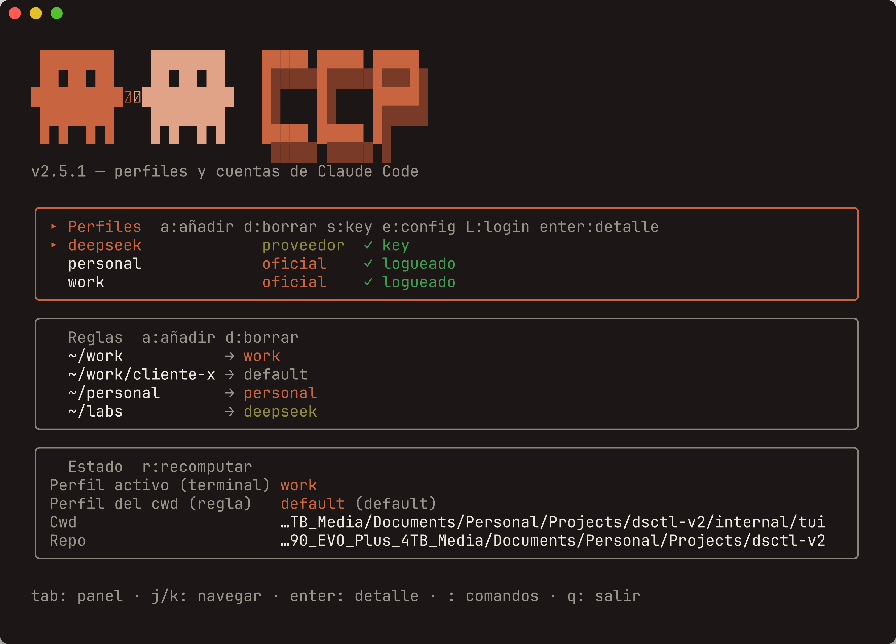
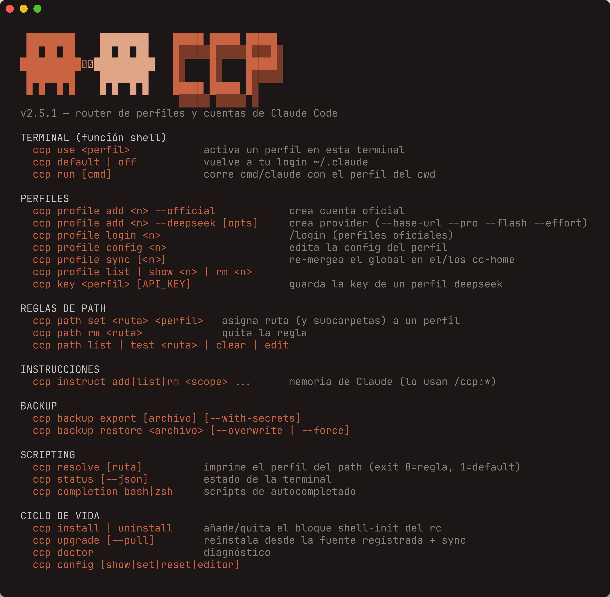

<div align="center">

# ccp

**Profiles for Claude Code.**

**English** · [Español](README.es.md)

**A different Claude Code account in every folder.**
In your work repo, your company account; in your personal project, your own; in your experiments, DeepSeek.
The switch happens on its own, just by `cd`-ing.




</div>

---

## What it is

`ccp` routes Claude Code to a **profile** per terminal and per folder — never global. A profile is one of three things:

- an **official** Anthropic account (its own isolated `CLAUDE_CONFIG_DIR`),
- a **compatible provider** (its `ANTHROPIC_BASE_URL` + API key) — built-in presets for **DeepSeek**, **Kimi** (Moonshot) and **GLM** (Z.ai), or
- the reserved **`default`**: your normal `~/.claude` login.

So: repo A → *work* account, repo B → *personal* account, repo C → *deepseek*. Without touching anything by hand.

## The mental model (30 seconds)

1. A **profile** is an identity (official, provider, or `default`).
2. A **rule** says "this folder (and its subfolders) uses such-and-such profile".
3. The **most specific** rule wins. No rule → your normal login.

```text
~/work          → perfil "work"      (cuenta empresa)
~/work/cliente  → perfil "default"   (carve-out: tu login normal)
~/personal      → perfil "personal"  (cuenta personal)
~/labs          → perfil "deepseek"
~               → default
```

When you enter a folder, `ccp` applies the right profile in that terminal via a hook. Then you run `claude` as usual.

## The interface

Run `ccp` with no arguments (with a TTY) and you get the **interactive dashboard** from the screenshot above: three panels (Profiles · Rules · Status) with keyboard navigation, health indicators (`✓` login / key), and a `:` command bar with **autocompletion** (Tab). Every action has its equivalent CLI command.

Press `c` (or `:config`) for the **Config view**, which takes over the body rather than adding a fourth panel — at 80 columns the three existing ones are already tight. Five sections: Defaults, Auto-handoff, Chain (reorder with `J`/`K`), allow_from, and Sensors. `e` opens the whole config in your graphical editor. The view never reimplements a rule: editing the chain from here goes through the same `core` functions as `ccp auto chain`, gate included.

No TTY, or prefer the terminal? Everything is in the CLI, with the same palette:

<div align="center">

</div>

---

## Before you start

- macOS or Linux with **bash** or **zsh**.
- **Claude Code** installed (`claude --version` should work).
- **git**.

## Installation

One line, nothing to clone:

```bash
curl -fsSL https://raw.githubusercontent.com/JoseAFlores777/ccp/main/install.sh | bash
```

Then, just once:

```bash
ccp install           # 2. shell function + automatic hook
source ~/.zshrc       # 3. reload YOUR shell (or ~/.bashrc)
ccp doctor            # 4. confirm it landed well
```

If step 1 warns you that `~/.local/bin` is not on your PATH, add it to your rc:

```bash
export PATH="$HOME/.local/bin:$PATH"
```

<details>
<summary>What that one line actually does — and how to pin, redirect or read it first</summary>

The installer **downloads the prebuilt binary** for your OS/arch (darwin/linux ×
amd64/arm64) from the GitHub Release and **verifies its sha256** against the
release's `checksums.txt`; a mismatch aborts the install. Because there is no
checkout around it, it also fetches the repo into `~/.config/ccp/src`
(`git clone --depth 1`, or a tarball if you have no git) — that copy is what the
`/ccp:` slash commands are installed from and what `ccp upgrade` re-runs later.

Prefer to read before you run, which is always the right instinct with `curl | bash`:

```bash
curl -fsSL https://raw.githubusercontent.com/JoseAFlores777/ccp/main/install.sh -o install.sh
less install.sh && bash install.sh
```

Env knobs (all optional, all also valid from a clone):

| Variable | Default | What it does |
|---|---|---|
| `CCP_RELEASE` | `latest` | Install a specific tag: `curl … \| CCP_RELEASE=v2.15.1 bash` |
| `CCP_BIN_DIR` | `~/.local/bin` | Where the binary lands |
| `CCP_SRC_DIR` | `~/.config/ccp/src` | Where the source copy lands |
| `CCP_NO_SOURCE` | `0` | `1` = binary only, no source copy (no `/ccp:` commands, no `ccp upgrade` source) |
| `CCP_FROM_SOURCE` | `0` | `1` = build with `go build` instead of using the release (needs Go) |
| `CCP_REPO` | `JoseAFlores777/ccp` | Install from a fork |

From a clone it's the same script and the same result — the only difference is
that `ccp upgrade` is then registered against **your** checkout:

```bash
git clone https://github.com/JoseAFlores777/ccp.git && cd ccp && ./install.sh
```

</details>

## Updating

`install.sh` records which source it installed from (`~/.config/ccp/src` with the
one-liner, your checkout with a clone), so updating is a single command:

```bash
ccp upgrade              # reinstall + resync profiles (profile sync)
ccp upgrade --pull       # 'git pull' before reinstalling
ccp upgrade --no-sync    # binary only, leave profiles alone
ccp upgrade --from-source  # build the registered repo instead of the release
```

`upgrade` installs the **latest release** published on GitHub; `--from-source`
builds whatever is in your checkout (needs Go), which is what you want to try a
change before tagging it.

When a version changes the **shell function** (the block in your rc), the upgrade
warns you and it has to be refreshed — a new binary alone cannot touch your
shell:

```bash
ccp install && source ~/.zshrc   # rewrites the stale block in place
```

If you're coming from the Bash version (`dsctl`) or an old `ccp`, **migration is automatic and lazy**: the first time you run any command that touches the config, it converts your state to `ccp.yaml` (schema v2), backing it up first in `~/.config/ccp/.backup-pre-go-<fecha>`.

---

## Usage

### Case 1 — Your work account in your work folder

```bash
ccp profile add work --official    # 1. crea el perfil oficial
ccp profile login work             # 2. una vez: dentro, /login y /quit
ccp path set ~/work work           # 3. asigna la carpeta
cd ~/work && claude                # 4. arranca con tu cuenta de trabajo
```

### Case 2 — Add your personal account

Same as case 1, with a different name and a different folder:

```bash
ccp profile add personal --official
ccp profile login personal
ccp path set ~/personal personal
```

### Case 3 — A folder with a compatible provider (DeepSeek / Kimi / GLM)

```bash
ccp profile add deepseek --deepseek   # perfil de proveedor (preset DeepSeek)
ccp profile add kimi     --kimi       # Kimi (Moonshot): base_url + modelos preconfigurados
ccp profile add glm      --glm        # GLM (Z.ai): base_url + modelos preconfigurados
ccp key deepseek                      # guarda la API key (te la pide oculta)
ccp path set ~/labs deepseek
cd ~/labs && claude
```

Each preset fills in the right `ANTHROPIC_BASE_URL`, default models and the
provider-recommended tuning vars (Kimi: `ENABLE_TOOL_SEARCH`,
`CLAUDE_CODE_AUTO_COMPACT_WINDOW`; GLM: `API_TIMEOUT_MS`,
`CLAUDE_CODE_AUTO_COMPACT_WINDOW`). Override any field with
`--base-url --pro --flash --effort`.

### Case 4 — Carve a subfolder out of its rule (carve-out)

Your `~/work` uses the work account, but there's one specific client where you want your normal login:

```bash
ccp path set ~/work/cliente-x default
```

`~/work` stays on "work", but `~/work/cliente-x` uses your normal login. The most specific subfolder always rules.

### Case 5 — Switch by hand in a terminal

```bash
ccp use personal      # activa un perfil aquí
ccp default           # vuelve a tu login normal
ccp run claude        # corre Claude una vez con el perfil del cwd, sin fijarlo
```

### Case 6 — See what's going on

```bash
ccp status            # perfil activo + perfil del cwd
ccp path list         # tus reglas de carpeta
ccp profile list      # tus perfiles
ccp doctor            # logins, keys, función de shell
```

---

## Handoff — continue a session under another profile

A live `claude` process freezes its credentials at startup, so `ccp use` can't hot-swap them. When a profile runs out of tokens/quota mid-conversation, `ccp handoff` does the only clean thing: it **persists the context → switches profile → resumes the same conversation** in a fresh process with the target profile's tokens.

You can keep **several handoffs in flight at once** — one per session, across as many repos as you like.

```bash
ccp handoff                       # manager panel: see what's in flight, pick an action
ccp handoff <to>                  # new handoff towards <to> (session picker)
ccp handoff <to> --session <uuid> # skip both pickers (scriptable)
ccp handoff resume  [<uuid>]      # re-enter a live handoff without closing it
ccp handoff end     [<uuid>]      # bring the updated context back to the origin and resume there
ccp handoff discard [<uuid>]      # drop a marker without bringing anything back
ccp handoff status  [--all]       # what's in flight here (or everywhere)
ccp handoff list                  # active + history (archived)
```

The mental model: **you borrow another profile's tokens for a session, and return the work when you come back.** `handoff end` back-syncs the updated context to the origin profile as a **new session** (non-destructive); the returned session shows `[from <profile>]` in its title. `handoff resume` is the opposite: it re-enters a handoff that is still alive without copying anything or closing it — that's what makes having several in flight useful.

**How `end`/`resume`/`discard` pick which handoff:** by the current directory. Exactly one active handoff for this repo → it acts on that one, no questions asked. Several → it asks (marker picker with a TTY; without a TTY it fails asking for `--session <uuid>`). None here → it fails and tells you which repos do have one. Passing the `<uuid>` explicitly skips the resolution entirely.

**When the transcript is gone — `handoff discard`:** if the session's jsonl no longer exists in the target profile (you cleaned `~/.claude`, deleted the profile…), `end` and `resume` have nothing to work with and always fail, and the marker would stay active forever — hijacking this repo's directory resolution, counting towards the five-handoff warning and blocking a new handoff from the target profile. `ccp handoff discard` archives that marker **without any back-sync**: no transcript is copied or rewritten, nothing is deleted from the target profile (whatever is left there can still be reached with `claude --resume <uuid>` from that profile), and your shell's profile doesn't change. It is not the normal way to close a handoff — that's `end`, which actually brings the work back.

**Skipping permission prompts:** all three launching commands (`handoff`, `handoff resume`, `handoff end`) accept `--dangerously-skip-permissions`, aliased `--yolo`: the resumed session starts without Claude Code's permission prompts. It is **not remembered** between invocations — it lives neither in the marker nor in `ccp.yaml`, so you ask for it every time (or toggle it with `y` in the panel).

`ccp handoff` with no arguments and a TTY opens the **manager panel**: active handoffs with this repo's first, `enter` resume · `e` end (asks for confirmation) · `n` new · `y` toggle skip-permissions · `q` quit. With nothing in flight the panel doesn't open at all: you go straight into the new-handoff wizard, profile → session.

Chained handoffs **by hand** are still refused (`A → B → C` on the same session — finish that one with `end` first; lending a *different* session of the same repo onwards is fine), and so is lending one session to two profiles at once. The auto-handoff supervisor *does* chain (see below), but it does it without stacking levels. Past five handoffs without closing, a new one warns you (it doesn't block). Entering a repo that has a live handoff prints a one-line reminder. `status`, `list` and `discard` work anywhere without launching anything — `handoff status` exits `0` when this repo has an active handoff and `1` when it doesn't; the commands that resume a session (`handoff`, `resume`, `end`) run through the ccp shell function, so `ccp install` must be active.

Two housekeeping subcommands round it off: `ccp handoff sessions [--json]` lists this directory's sessions in the active profile (that's the picker's data, scriptable), and `ccp handoff prune [--keep N]` trims the archived history — it grows one entry per closed handoff and nothing ever removed them (`--keep` defaults to 50; `--keep 0` wipes it). Both are read-only-ish and don't need a TTY, but a shell function installed *before* they existed forwards them as if they were a target profile — if you get an error saying so, run `ccp install` and open a new terminal.

---

## Auto-handoff — rotate profiles on their own when usage runs out

`ccp handoff` is the manual answer to "this account ran out". `ccp session` is the automatic one.

The problem it solves: a long session (a big refactor, an overnight batch) dies when the account hits its 5-hour, weekly or Opus limit. And a live `claude` **cannot** change profile — `ANTHROPIC_BASE_URL`, `ANTHROPIC_AUTH_TOKEN` and `CLAUDE_CONFIG_DIR` are read once at startup. So the only clean fix is a **supervisor** that runs `claude` as a child, watches for the limit, hands the session off to another profile, and relaunches it there.

```bash
ccp auto init                     # seed the auto_handoff block in ccp.yaml
ccp auto install                  # install the sensors in every non-default profile
ccp session --dry-run             # what would it do here? (chain, thresholds, samples)
ccp session                       # interactive: claude under the supervisor
ccp session -p --policy overnight -- "refactor the parser"   # headless (cron/CI)
ccp auto status [--json]          # resolved policy, sensors, last samples, cooldowns
ccp auto test [--profile <n>]     # is the detection path actually wired?
```

`ccp session` reaches the binary through the `*) command ccp "$@"` branch the shell function already has, so **no `ccp install` refresh is needed** for it.

In practice you can skip the first two lines: run `ccp session` in a repo that isn't set up and it lists what's missing — the rule, the policy, the sensors — shows the exact path it would write, and asks once. Answer and it applies each gap through the same code path as the command you'd have typed. It asks **once per repo**, whatever you answer; `--setup` offers it again, `--no-setup` skips it.

It never asks, and never writes, unless **both ends of the conversation are a terminal**. With `-p`, without a TTY, or with the output redirected to a file, it just says why and carries on as before. `ccp session -p` runs from cron: a prompt there hangs the job, and a prompt written to a log is worse — you would never see the question your Enter answered.

### The cycle: primary → loan → back to the primary

The **primary** is whatever `ccp resolve $PWD` returns — the natural owner of the directory. Every other profile in the chain is a **temporary loan**. The supervisor is a pendulum, not a round-robin: it swings out when the primary is exhausted and comes back the moment the primary's window reopens, even if fresh loans are still available. Working for hours in the wrong account is worse than waiting.

```
personal-cc  ──[limit]──→  app-cc  ──[limit]──→  personal-deepseek
                                       │
                                       └──[primary's window reopened]──→ personal-cc
```

The trip home is not a reverse handoff: it is `handoff end`, which back-syncs the conversation to the primary **as a new session with a new uuid** (non-destructive, the old transcript stays where it is). The supervisor prints that new uuid — it's what you'd type into `claude --resume` to continue by hand. When the chain runs dry it stops with exit code **75** (`EX_TEMPFAIL`, "retry later") and a table of when each profile frees up; the marker is left alive so nothing is lost.

There is one loan that has no marker to close: a rotation that fired *before* the conversation existed (the proactive sensor can trip on a session that hasn't had its first turn) has nothing to lend, so no handoff is opened. Coming back from one of those doesn't run `handoff end` at all — if a conversation was born during the loan it is **adopted** into the primary as a new session, and if none was, the primary simply starts fresh. Either way the trace says which happened. What never happens is a marker pointing the wrong way (`{from: loan, to: primary}`), which would send the next clean exit — and you — to the wrong account.

While the session is on loan, a **`return_check` timer** asks on its own, every N minutes, whether the primary's window has reopened — nobody has to hit a limit for you to come home. That is the whole point: the primary's 5-hour window reopens at 3am, and no sensor fires when an *other* account frees up, so without the timer the run would spend the night in the loan. The trip home still honours `min_dwell` (you are not yanked out of a loan you arrived at 30 seconds ago), and the profile you leave is **not** marked exhausted — you left it voluntarily, it keeps its credit:

```
p2 (2h 00m) ──[return_check: personal-cc ya liberó su ventana]──→ volviendo a personal-cc (vuelta a casa, no gasta préstamo: siguen 1/6)
```

**The trip home waits for silence (`return_idle`, default 90s).** This is the only move the supervisor makes for its own reasons: rotating on a limit kills a child that *cannot work any more* (its account is answering 429), but coming home would kill one that works fine. With the defaults alone (`min_dwell: 20m` + `return_check: 10m`) any loan longer than twenty minutes would end the instant the primary's cooldown expired — while you are typing, mid-turn, or with a tool call in flight, and an interrupted tool call is re-run by `--resume` and may not be idempotent. So the timer additionally requires the session to be **idle**: the transcript (which grows with every turn and every tool result) must not have been touched for `return_idle`. If it never goes quiet, nothing is forced — the timer just keeps offering; you come home when you stop, when the child exits on its own, or at the next limit. Missing a chance to come home is cheap; taking the terminal away mid-sentence is not. A transcript that does not exist does **not** count as idle (we know nothing, and killing out of ignorance is the thing being avoided), and `return_idle: 0s` is an explicit opt-out. The rule applies in headless (`-p`) too: nobody watching does not make a half-finished tool call any less fragile.

```
ccp session: p1 ya liberó su ventana; la sesión sigue activa, se volverá cuando lleve 1m30s en silencio
```

**`max_hops` counts loans, not moves.** Coming home is the *closing* of a loan, so it neither consumes budget nor is blocked by an exhausted one — otherwise `max_hops: 6` would mean "three round trips" and a spent budget would strand the conversation in someone else's account with the primary sitting free. It is still a hard anti-loop backstop: every trip home has to be preceded by a loan, and that one does pay, so a run can never make more than `2 × max_hops + 1` launches.

### Configuring it (`auto_handoff` in `ccp.yaml`)

`ccp auto init` seeds this from your existing profiles; edit it by hand afterwards.

```yaml
auto_handoff:
  enabled: true              # master switch: false = ccp session refuses to run
  hooks: [personal-cc, app-cc]   # profiles with the sensor layer installed
                                 # (managed by `ccp auto install/uninstall`)
  policies:
    default:
      # Loans, in order of preference. The primary is IMPLICIT (ccp resolve $PWD)
      # and is silently dropped if you list it here.
      fallback: [app-cc, personal-deepseek]
      threshold: 90          # % of the usage window that triggers a proactive hop
      min_dwell: 20m         # min time before rotating (full only for the proactive sensor)
      max_hops: 6            # hard cap on LOANS per run (anti-loop backstop;
                             # coming home is free, see above)
      return_check: 10m      # how often to reconsider the primary while on loan
      return_idle: 90s       # …and how long the session must have been SILENT
                             # before that proactive trip home may kill the child
                             # (0s opts out: come home even mid-turn)
      cooldown:
        strategy: resets_at  # use the resets_at the API reports (subscriptions)
        fallback: 1h         # …or this fixed wait when there is no resets_at

    overnight:               # `ccp session -p --policy overnight`
      fallback: [personal-cc, app-cc]
      threshold: 85
      max_hops: 12

    work:
      fallback: []           # no loans at all: if the primary dies, the run stops

  allow_from:                # compliance gate (see below)
    emco-cc: [emco-cc]                                   # never rotates
    app-cc: [app-cc, personal-cc]
    personal-cc: [personal-cc, app-cc, personal-deepseek]
```

> **What the `return_check` timer actually does — it is not a passive clock.** It is armed only while the session is on **loan**: there has to be a live handoff marker whose origin is the primary (a *degraded* rotation — one that happened before any transcript existed and so never opened a marker — does not count), plus `--no-return` off and `return_check > 0`. While armed it re-decides once per period, and each decision is cheap: a few comparisons plus one `stat` of the transcript. What is *not* cheap is what happens when the decision comes out "go home" — its only action is to **`SIGTERM` the running `claude`** (10s of grace so it flushes its `.jsonl` and runs its `SessionEnd` hooks), close the loan, and **relaunch** `claude --resume` in the primary under the new uuid. That is a killed process and a fresh child, not a timestamp comparison. Hence the four conditions it demands before firing, all of them: a live loan · the primary's cooldown expired · `min_dwell` already served in the current profile · the session **idle** for `return_idle`. A limit event already queued from a sensor also beats it (rotating instead preserves the cooldown of the profile being left). If any condition is missing it simply waits and asks again next period — it never forces the move. Disable it with `return_check: 0s` (you then come home at the next limit event, as before) or `--no-return`.
>
> `--no-return` switches off the **mid-session** trip home — the timer and the pendulum rule in `Next()` — not the cleanup at the end of the run. When the child finally exits 0 with a loan still open, the loan is always closed and the conversation lands back in the primary under a new uuid, `--no-return` or not. That is deliberate: the alternative is a finished conversation stranded in a borrowed account behind a marker you have to remember to `ccp handoff end` tomorrow, while your repo keeps resolving to the profile that lent it. If you *want* it to stay there, end the run with Ctrl-C (exit 130 leaves the marker alive on purpose) or drop the marker later with `ccp handoff discard`.

**Why `allow_from` exists:** rotating on its own, at 3am, with nobody watching, means a client's conversation could end up in a personal account — or in a third-party provider's API. Path rules are *geographic* (which folder belongs to whom), not a statement of trust, so the gate is separate and explicit. The exact rule:

| `allow_from` | Effect |
|---|---|
| absent or empty | **no gate** — the whole `fallback` chain is allowed |
| declared, with an entry for the primary | only the profiles listed in that entry are allowed; the rest show up as *denied* |
| declared, **without** an entry for the primary | **total deny** — no loans at all |

That last row is the point: declaring the map is declaring the intent to govern loans, so a profile you forgot to add stays put instead of inheriting a free pass. `ccp session --dry-run` and `ccp auto status` both print what was denied and why.

> **The row you'll hit first.** `ccp auto init` seeds `allow_from` with one entry per *named* profile, and `default` is never one of them. So in a directory with no path rule the primary is `default`, there is no entry for it, and the whole chain shows up as denied — `ccp session` still runs, it just has nowhere to hop when the limit lands. Either set a rule (`ccp path set . <profile>`) or add a `default:` entry to `allow_from` yourself. `--dry-run` shows this immediately: `chain: (empty)` with everything under *denied*.

### Editing the chain — add, reorder or remove a loan

```bash
ccp auto chain                        # the EFFECTIVE chain for this directory
ccp auto chain add personal-deepseek  # append it, and authorise the loan
ccp auto chain add app-cc --at 1      # insert at a 1-based position
ccp auto chain mv app-cc 2            # reorder — the order IS the preference
ccp auto chain rm personal-deepseek   # take it out, and withdraw the authorisation
ccp auto chain set app-cc,emco-cc     # replace the whole chain
```

All of them take `--policy <name>` (default: `default`) and act on the primary of the **current directory**, which is the one whose `allow_from` entry they are allowed to touch.

**`add` writes two keys, and that is the whole point.** Whoever types "add it to the chain" wants the profile to *be used*, and a `fallback` entry without its `allow_from` is never used — silently. Leaving the two keys apart in the CLI would just reproduce the trap the YAML already sets. But `allow_from` is a **compliance gate** and may be there on purpose, so the widening has three hard limits:

1. It touches **only** the entry of the primary that the current directory resolves to. Never anyone else's — a blanket rewrite would widen permissions for repos you are not even standing in.
2. It prints **exactly what changed in each key, separately**. `+name` authorises, `-name` withdraws.
3. `--no-allow` turns it off.

`rm` (and the profiles that `set` drops) goes the other way and **withdraws** the authorisation, again only from that one entry. That is what makes `add` reversible: without it the gate could only ever grow, and undoing a mistaken `add` would mean hand-editing the YAML — exactly what these commands exist to avoid.

```console
$ ccp auto chain add personal-deepseek

[ok] fallback   app-cc → emco-cc → personal-deepseek
[ok] allow_from personal-cc: +personal-deepseek

effective chain from this repo:
  app-cc → emco-cc → personal-deepseek
```

Every mutation ends by re-reading the effective chain **from disk**, so you see what the engine will see — including anything `allow_from` is still blocking.

| What you want | Command |
|---|---|
| Add a loan | `ccp auto chain add <profile>` (writes `fallback` **and** `allow_from[<primary>]`) |
| Change the preference order | `ccp auto chain mv <profile> <pos>` — the **order is the preference** |
| Remove a loan | `ccp auto chain rm <profile>` (withdraws the authorisation too; `--no-allow` keeps it) |
| Stop rotating in a directory | `ccp auto chain rm` every loan, or give that primary a policy with `fallback: []` |
| A different chain for a different job | add another policy under `policies:` and use `--policy <name>` |

Editing the file by hand is still perfectly fine, and is how you add a whole new policy. `ccp` rewrites `~/.config/ccp/ccp.yaml` atomically while **preserving your comments and any keys it doesn't know**, so an annotation about why a profile is in the list survives every later `ccp path set`, `profile add` or `auto install`.

```yaml
auto_handoff:
  policies:
    default:
      # Order IS preference: app-cc first, the provider only as a last resort.
      fallback: [app-cc, personal-deepseek]
  allow_from:
    personal-cc: [personal-cc, app-cc, personal-deepseek]   # ← the primary's entry
```

The rules the resolver applies to `fallback`, in one pass: the **primary is implicit** and is dropped silently if you list it; duplicates are removed (they don't buy an extra loan); `default` is a legitimate target (it's your normal `~/.claude` login); and the order you wrote is kept verbatim.

> **The one command that gets you out of a total deny.** In a directory whose primary has no `allow_from` entry, `ccp auto chain show` says `chain (none)` while every profile is already sitting in `fallback` (that is what `ccp auto init` seeds). `ccp auto chain add <profile>` handles that: a profile already in the chain but blocked by the gate is *not* treated as a duplicate — it creates the entry, tells you the chain itself did not change, and the repo starts rotating.

Then, the two verification steps — chain membership is **not** the same as detection:

```bash
ccp auto install personal-deepseek    # sensors for the newly added profile
ccp session --dry-run                 # what the chain resolves to, here
```

```
política: default
primario: work (cwd /home/me/repo)
cadena de préstamos: app-cc → deepseek
umbral 90% · min_dwell 20m0s · max_hops 6 · return_check 10m0s · return_idle 1m30s · cooldown resets_at (respaldo 1h0m0s)
```

If you only edited `fallback` and forgot `allow_from`, `--dry-run` says so instead of silently doing nothing — this is the single most common mistake:

```
cadena de préstamos: (vacía)
denegados por allow_from: app-cc, deepseek
```

**A name that doesn't exist is a hard error, not a silent skip.** A typo — or a profile you removed — stops `ccp session` before it launches anything, with exit `1`:

```
[error] política "default": el perfil de fallback "app" no existe
```

> **`ccp profile rename` and `ccp profile rm` do not touch `auto_handoff`.** They move your path rules and your handoff markers, but the rotation policy is left exactly as it was — so renaming or deleting a profile that is in a chain leaves a dangling name, and the next `ccp session` in that directory fails with the error above until you fix the YAML. Three places carry profile names: `policies.*.fallback`, `allow_from` (**both** the keys and the lists) and `hooks`. Grep for the old name before you close the file.

> **`ccp auto init --force` regenerates the block from scratch**, so it discards your hand edits *and* your comments. Use it to start over, not to refresh. Plain `ccp auto init` is idempotent: with a block already present it does nothing.

Note that `ccp auto init` deliberately leaves provider profiles (DeepSeek/Kimi/GLM) out of every *other* profile's seeded `allow_from`. Sending a conversation to a third-party API is exactly the decision the gate exists to make explicit, so adding one to a chain is always a manual act.

### The sensors — three at a time, four in total

Three sensors run at once in each mode, because none of them covers everything. Redundancy is deliberate: detecting the same limit twice is free (the supervisor de-duplicates by content), being blind is not.

| Sensor | What it reads | Proactive? | Interactive | Headless |
|---|---|---|---|---|
| **statusLine** (`ccp _statusline`) | `rate_limits.{five_hour,seven_day}.used_percentage` that Claude Code feeds the status bar; `<cc-home>/.claude.json` as a stale-sample fallback | ✅ fires at `threshold` % **before** a turn fails | ✅ | ❌ (no TTY ⇒ no status bar) |
| **stream-json** | the `api_retry` / `error: "rate_limit"` events of `claude -p --output-format stream-json` | ❌ reactive | ❌ (nothing to parse) | ✅ |
| **transcript tail** | the session's `.jsonl`, looking for `"error":"rate_limit"` / `apiErrorStatus: 429` | ❌ reactive | ✅ | ✅ |
| **StopFailure hook** (`ccp _limit-hook`) | the hook payload Claude Code sends when a turn dies; leaves a sentinel in `~/.config/ccp/state/auto/sentinels/` | ❌ reactive | ⚠️ unverified (see below) | ✅ |

So: **interactive** runs statusLine + transcript + sentinel; **headless** runs stream-json + transcript + sentinel. Only the statusLine sensor is proactive, and it is the one that does *not* work headless — which is why the headless path leans on the (very clean) `api_retry` event instead.

⚠️ **Not yet verified empirically:** whether the `StopFailure` hook fires at all in interactive with a *subscription* limit (Claude Code doesn't end the turn there — it offers `/rate-limit-options`). If it doesn't, interactive detection rests on the statusLine percentage plus the transcript tail. `ccp auto test` verifies the wiring, not Claude Code's behaviour.

### `ccp auto install` touches your profiles' `settings.json`

The two in-process sensors can only be turned on from `cc-home/settings.json`, and that file is **generated** (global ⊕ overlay). So `ccp auto install <profile>` adds the profile to `auto_handoff.hooks` and regenerates: the merge becomes global ⊕ overlay ⊕ **auto layer**, which adds

- `hooks.StopFailure` → `ccp _limit-hook`
- `statusLine` → `ccp _statusline -- <your original statusLine>` (yours is **wrapped**, not replaced — it still renders your status bar; ccp only samples the stdin it gets)

If you had **no** statusLine of your own, ccp paints a minimal one instead: the profile plus both usage windows, each with a gauge and a countdown to its reset — `emco-cc  5h ▏█░░░░░░░░░▏ 2% ·2h13m  7d ▏██████░░░░▏ 59% ·3d`. Both are shown because both are watched independently (whichever crosses `threshold` first triggers the hop), and a bare percentage wouldn't say whether you have hours or days left.

The gauge is tinted green below 70%, amber from 70 to 89, and red at 90 and above — the red starts exactly at `threshold`'s default, so the bar and the engine never tell different stories. `NO_COLOR` drops the tint and the gauge still reads.

Three things the bar deliberately won't say. A window **with no data** is omitted rather than drawn as `0%`. A `resets_at` that has already passed prints **no countdown**: stale data must not claim your quota is back. And days round **up** — `·3d` with 2d23h left, never `·2d`, because the one thing a countdown must never do is promise the quota returns sooner than it will.

The line sizes itself: ccp renders it at three levels of detail, measures each, and prints the widest one that fits. A long profile name costs gauge cells, not correctness — if nothing fits, you get the compact form uncut, because the first thing truncation would eat is the profile name.

Any `StopFailure` hook you already had is preserved alongside ours. It is fully reversible: `ccp auto uninstall <profile>` drops it from the list and regenerates back to global ⊕ overlay. Your overlay is never modified either way — the source of truth for "who has the sensors" is `auto_handoff.hooks` in `ccp.yaml`, not the generated file.

> The layer records the **absolute path** of the `ccp` binary. If you move it without running `ccp upgrade` (or `ccp auto install` / `ccp profile sync`), the sensors keep pointing at the old path.

### A session, and its trace

```
$ ccp session
# primary = personal-cc (path rule for ~/Documents/Personal)

▶ personal-cc · new session 3f9c1a2b                                    (stderr)
personal-cc (4h 03m) ──[uso 94% ≥ umbral 90% (ventana session) · statusline]──→ handoff a app-cc (préstamo 1/6)
▶ app-cc · reanudando 3f9c1a2b                                          (stderr)
app-cc (1h 12m) ──[You've hit your session limit · transcript]──→ volviendo a personal-cc (vuelta a casa, no gasta préstamo: siguen 1/6)
sesión devuelta a personal-cc como 7d0e44f1
▶ personal-cc · reanudando 7d0e44f1                                     (stderr)
personal-cc ──[termina]──→ ✅ exit 0
```

**Reading the counter.** Every movement ends in the same budget, worded one way only: an outbound move is `préstamo N/6` (this is loan N of your `max_hops`), and a trip home is `vuelta a casa, no gasta préstamo: siguen N/6`. The number does *not* rise on the way home — coming back is the closing of a loan, not a new one (see `max_hops` above) — so the line says so out loud rather than leaving you to wonder why two consecutive moves show `1/6`. The trip home is never called a *préstamo*, whichever of the two things caused it (a limit in the loan profile, or the `return_check` timer): it's the same event, so it gets the same words.

The trace (hops, the trip home, the cooldown table) goes to **stdout** because it *is* the command's output — it's what ends up in the cron log. The operational chatter (`▶ launching…`, "waiting for min_dwell") goes to **stderr**, so that in headless mode stdout stays parseable: there it carries the child's `stream-json` verbatim.

Exit codes: `0` ok · `1` usage/config error · `2` handoff I/O failure · `75` every profile exhausted (retry later) · anything else is claude's own exit code, so `ccp session -p …` drops into a script where `claude -p …` used to be.

**Some sharp edges worth knowing.** `--yolo` (`--dangerously-skip-permissions`) is effectively required for unattended runs, and it is never persisted — you ask for it every time. A hop is a `SIGTERM` at a turn boundary, so an interrupted tool call gets re-run by `--resume` and may not be idempotent. `Ctrl-C` (exit 130) never rotates: the loan is left open and told to you. And `min_dwell` applies **in full only to the proactive sensor** — the one that warns before anything has failed. A reactive event means the turn already failed, so sitting out twenty minutes inside an account that is answering 429 would be pure harm: those rotate after a short 30s floor, which still keeps three profiles from burning in one minute. The trip home is the exception and honours the full value: nobody is in a hurry there.

---

## Claude Desktop — one window per profile

`ccp desktop` opens an isolated **Claude Desktop** instance per profile: account, MCP servers, Cowork
environment… and the Code tab. You can keep work and personal open side by side.

```bash
ccp desktop open emco            # launch the 'emco' profile's instance
ccp desktop open                 # no profile: whichever the current directory resolves to
ccp desktop list                 # instances on disk and their size
ccp desktop open emco --dry-run  # print the plan without launching or touching anything
```

It works **without reinstalling the rc** (`ccp install` is only needed for completion).

### The isolation is two things, and the second one is the invisible one

`--user-data-dir` moves the app's identity: session, tokens, `claude_desktop_config.json` (MCP) and
Cowork state. That is half of it.

The other half is the **Code tab**, which does *not* read that directory: it reads `CLAUDE_CONFIG_DIR`
from the Desktop process's environment, falling back to `~/.claude` when empty. Without injecting it,
two windows on different accounts would share CLI credentials, `projects/`, history and agents.
`ccp desktop` emits both, so the whole window — chat and Code tab — sits on the same profile as your
terminal.

### What it changes in the profile's `cc-home`

Desktop **refuses symlinked directories** under its config root, and `ccp profile add` seeds exactly
that (`cc-home/commands -> ~/.claude/commands`). The first time you open an instance, `ccp` converts
those entries into **real** directories whose files are symlinks to the global one:

- commands and plugins stay shared live with `~/.claude`;
- `agents/` and `skills/` become the profile's own, so **each profile can have its own agents**;
- a file of yours inside the profile wins over the global one and is never overwritten on re-mirror.

When you add new files to the global config, re-mirror with `ccp desktop prepare <profile>`.

### Limits

- **`official`** and **`default`** profiles only. Claude Desktop does not read `ANTHROPIC_BASE_URL`, so
  a DeepSeek/Kimi/GLM profile is refused rather than leaving you with a half-configured window.
- **`default` is never relocated**: its instance is the usual one, in the usual place.
- Each instance downloads its own copy of the embedded Claude Code (~190 MB), plus the Cowork
  environment if you use it. `ccp desktop list` tells you how much each one takes.
- **Sign in one at a time**: `claude://` links go to whichever instance registered the scheme last, so
  with several windows open a login can land on the wrong one. `ccp` reminds you on each instance's
  first launch.
- `ccp desktop rm <profile> --yes` deletes the instance: it is a logout that takes session, tokens and
  MCP config with it.

## Backup and restore

Take everything to another machine, or back it up before a big change:

```bash
ccp backup export ~/ccp-backup.tar.gz                 # ccp.yaml + overlays
ccp backup export ~/ccp-backup.tar.gz --with-secrets  # + api_key + logins (chmod 600)
ccp backup restore ~/ccp-backup.tar.gz                # no pisa; fusiona reglas
ccp backup restore ~/ccp-backup.tar.gz --overwrite    # reemplaza perfiles del backup
ccp backup restore ~/ccp-backup.tar.gz --force        # borra todo y restaura limpio
```

Before restoring, `ccp` saves an automatic snapshot in `~/.config/ccp/.backup-pre-restore-<fecha>`.

## Per-profile config

Each profile has its own Claude config, applied as a **baseline layer** when it's active:

```bash
ccp profile config <perfil>                 # menú: instrucciones / settings / ambos
ccp profile config <perfil> instructions    # abre overlay/CLAUDE.md
ccp profile config <perfil> settings         # abre overlay/settings.overlay.json
ccp profile sync [<perfil>]                  # re-mergea cambios del global ~/.claude
ccp profile rename <old> <new>               # rename: rules, markers, login and key included
ccp config editor "code -w"                  # editor a usar (fallback: $EDITOR)
```

- **Instructions**: `cc-home/CLAUDE.md` does an `@import` of the global `~/.claude/CLAUDE.md` and then of your overlay.
- **Settings**: `cc-home/settings.json` = global ⊕ overlay (pure-Go deep-merge).
- **Real precedence**: it's a baseline — the repo's config (`.claude/settings.json`) wins on conflict.
- `default` has no overlay: `ccp profile config default` opens your global `~/.claude` directly.

### Editing `ccp.yaml` — `ccp config edit`

```bash
ccp config edit                     # opens ~/.config/ccp/ccp.yaml, then re-reads and validates it
ccp config edit --profile personal-cc   # opens that profile's overlay instead
ccp config edit --terminal          # force the terminal editor ($EDITOR / nano)
ccp config gui-editor "code -w"     # pin the GUI editor for good
```

The editor is the **first rung that exists**: `--editor <cmd>` → `defaults.gui_editor` → `$VISUAL` → VS Code and family on the `PATH` (`code` → `cursor` → `code-insiders`, invoked with `-w`) → an OS launcher (`open -W -t`, `notepad`, `xdg-open`) → `defaults.editor` / `$EDITOR` / `nano`. The command tells you which rung won.

**The `-w` is the decision, not a detail.** `code file` returns instantly, and without waiting for the editor to close there is no way to do the one thing that gives this command value: **re-read the YAML and validate it**. A `ccp.yaml` broken by a graphical edit does not show up when you save — it shows up in the next `ccp session`, mid-hop, as a parse error at 3am. So when the editor blocks, `ccp` reloads the file and checks the semantics of `auto_handoff` (every policy through `Effective()`, every fallback profile actually existing) and names the offending key and value if it fails.

When the editor **does not** block (`xdg-open`, or `code` without `-w`) that validation is impossible, and `ccp` says so instead of pretending otherwise — including on the `--profile` path, where it also skips regenerating the `cc-home` and points you at `ccp profile sync <name>` for when you finish.

## `/ccp:` commands — remember and explore artifacts

`ccp` includes five Claude Code commands to persist instructions, agents, hooks and MCP servers straight from the conversation, without editing files by hand:

| Command | What it does |
|---|---|
| `/ccp:remember-global <texto>` | Persists to the global `~/.claude` (all profiles) |
| `/ccp:remember-profile <texto>` | Persists to the active profile's overlay |
| `/ccp:remember-project <texto>` | Persists to the current git repo's `.claude/` (versioned) |
| `/ccp:recall [scope]` | Lists what ccp manages (`global` · `profile` · `project`) |
| `/ccp:forget [scope]` | Deletes by index (lists and confirms first) |

They install with `install.sh` into `~/.claude/commands/ccp/` and become available across all profiles. The equivalent CLI surface is `ccp instruct <add\|list\|rm\|dest\|record>`.

---

## Language

`ccp` speaks English by default and also Spanish. Pick whichever you like; the choice persists in `ccp.yaml`.

```bash
ccp lang              # muestra el idioma actual + de dónde sale (env/config/default)
ccp lang en           # cambia a inglés y lo persiste en ccp.yaml
ccp lang es           # cambia a español y lo persiste en ccp.yaml
```

- `CCP_LANG=en|es` — environment override; it takes precedence over the config. The default is English.
- In the interactive TUI, press **`L`** to toggle the language live (it persists). Note: in the TUI, profile **login** is on lowercase **`l`**, and **`L`** (uppercase) toggles the language.

### TUI keyboard shortcuts

| Key | Action |
|---|---|
| `j` / `k` (or ↓/↑) | Move the selection |
| `Tab` / `Shift+Tab` | Switch panel (Profiles / Rules / Status) |
| `Enter` | Toggle detail (Profiles) |
| `a` | Add |
| `d` | Delete |
| `s` | Set key (DeepSeek) |
| `e` | Edit config |
| `l` | Login (official) |
| `L` | Toggle language (EN/ES) |
| `:` | Command bar |
| `q` / `Ctrl+C` | Quit |

---

## Configure by hand (`ccp.yaml`)

Everything lives in `~/.config/ccp/ccp.yaml` (or `$CCP_HOME/ccp.yaml`). You can touch it with commands or by hand:

```yaml
version: 2
defaults:                  # plantilla para perfiles deepseek NUEVOS
  base_url: https://api.deepseek.com/anthropic
  model_pro: deepseek-chat
  model_flash: deepseek-chat
  effort: high
  editor: nano
profiles:
  work:                    # oficial: solo 'type'
    type: official
  deepseek:                # proveedor: los 4 campos, explícitos
    type: deepseek
    base_url: https://api.deepseek.com/anthropic
    model_pro: deepseek-chat
    model_flash: deepseek-chat
    effort: high
rules:                     # carpeta → perfil (ruta absoluta)
  - path: /Users/tu/work
    profile: work
  - path: /Users/tu/work/cliente-x
    profile: default       # carve-out
authored: []
```

- `default` is **implicit**: never put it in `profiles`. For an exception, use `profile: default` in a rule.
- The API key does **not** go here: it lives in `~/.config/ccp/profiles/<n>/api_key` (`chmod 600`). Edit it with `ccp key <n>`.
- `ccp` writes atomically under a `flock`, preserves your comments, and aborts if `version` is higher than the one it knows.

With commands: `ccp config show` · `ccp config set <clave> <valor>` · `ccp config reset`.

---

## Troubleshooting

| Symptom | Fix |
|---|---|
| `ccp: command not found` | `~/.local/bin` is not on your PATH (Installation step 2). |
| `ccp use …` does nothing | The shell function is missing: `ccp install` and then `source ~/.zshrc`. |
| I changed folders and the profile didn't change | The hook remembers the last folder; refresh with `cd .` |
| Opening Claude says "Not logged in" | That official profile has no session: `ccp profile login <n>`. |
| See a folder's profile without entering it | `ccp resolve ~/ruta/que/sea` |
| How do I switch the output language? | `ccp lang en\|es`, `CCP_LANG=es`, or press `L` in the TUI. |
| Does ccp change anything inside Claude Code? | No. It only points Claude Code at a per-folder profile (its own config dir / provider). Your accounts and settings are untouched. |
| Where are my API keys stored? | Under `~/.config/ccp/profiles/<n>/api_key`, `chmod 600`. Never in `ccp.yaml`, the shell rc, or git. |
| How do I rename a profile? | `ccp profile rename <old> <new>` (or `r` in the TUI). Its rules, handoff markers, login and API key move with it; if that terminal had it active, run `ccp use <new>`. |
| How do I update ccp? | `ccp upgrade` (re-runs the installer + `profile sync`). |
| How do I uninstall? | `ccp uninstall` (removes the shell block); optionally `rm -rf ~/.config/ccp`. |

## Quick reference

| I want to… | Command |
|---|---|
| Create an official account | `ccp profile add <n> --official` |
| Log in to it | `ccp profile login <n>` |
| Create a DeepSeek provider | `ccp profile add <n> --deepseek` |
| Create a Kimi provider | `ccp profile add <n> --kimi` |
| Create a GLM provider | `ccp profile add <n> --glm` |
| Save its API key | `ccp key <n>` |
| Assign folder → profile | `ccp path set <ruta> <perfil>` |
| Remove a rule | `ccp path rm <ruta>` |
| See rules / profiles | `ccp path list` · `ccp profile list` |
| Switch by hand | `ccp use <n>` · `ccp default` |
| Continue a session under another profile | `ccp handoff [<n>]` |
| Re-enter a live handoff | `ccp handoff resume [<uuid>]` |
| Return a handoff to its origin | `ccp handoff end [<uuid>]` |
| Drop a stale handoff marker | `ccp handoff discard [<uuid>]` |
| See what's in flight | `ccp handoff status [--all]` |
| Trim the handoff history | `ccp handoff prune [--keep N]` |
| Rotate profiles automatically on a limit | `ccp session` (`-p` for headless) |
| See what `ccp session` would do | `ccp session --dry-run` |
| Set up auto-handoff | `ccp auto init` then `ccp auto install` |
| Auto-handoff policy / sensors | `ccp auto status [--json]` |
| Open Claude Desktop with a profile | `ccp desktop open [<n>]` |
| Status / diagnostics | `ccp status` · `ccp doctor` |
| Backup / restore | `ccp backup export\|restore` |
| Update | `ccp upgrade` |
| Full help | `ccp help` |

> **For scripting:** `ccp resolve [ruta]` prints the profile (exit `0` = non-default, `1` = default), and `ccp status --json` returns `active`, `profile`, `profile_type`, `cwd` and `repo`.

## Interactive guide

Prefer a visual step-by-step guide? Open [`README.html`](README.html) in your browser — it's a single-page app with a routing playground, tooltips and all the cases:

```bash
open README.html        # macOS
xdg-open README.html    # Linux
```

## Uninstall

```bash
ccp uninstall           # quita la función de shell del rc
rm -rf ~/.config/ccp    # (opcional) borra config y perfiles
```

---

MIT — see [`LICENSE`](LICENSE). Curious how it works under the hood? Check [`CLAUDE.md`](CLAUDE.md) and the [source on GitHub](https://github.com/JoseAFlores777/ccp).

## Disclaimer & trademarks

**Use at your own risk.** This software is provided "as is", without warranty of
any kind (see [`LICENSE`](LICENSE)). You are responsible for your own API keys,
accounts, and configuration.

**Not affiliated.** `ccp` (profiles for Claude Code) is an independent, community
project. It is **not affiliated with, endorsed by, or sponsored by** Anthropic,
DeepSeek, Moonshot AI or Z.ai. "Claude" and "Claude Code" are trademarks of
Anthropic, PBC; "DeepSeek", "Kimi" (Moonshot) and "GLM" (Z.ai) are trademarks of
their respective owners. These names are used only to describe interoperability.
See [`NOTICE`](NOTICE).
